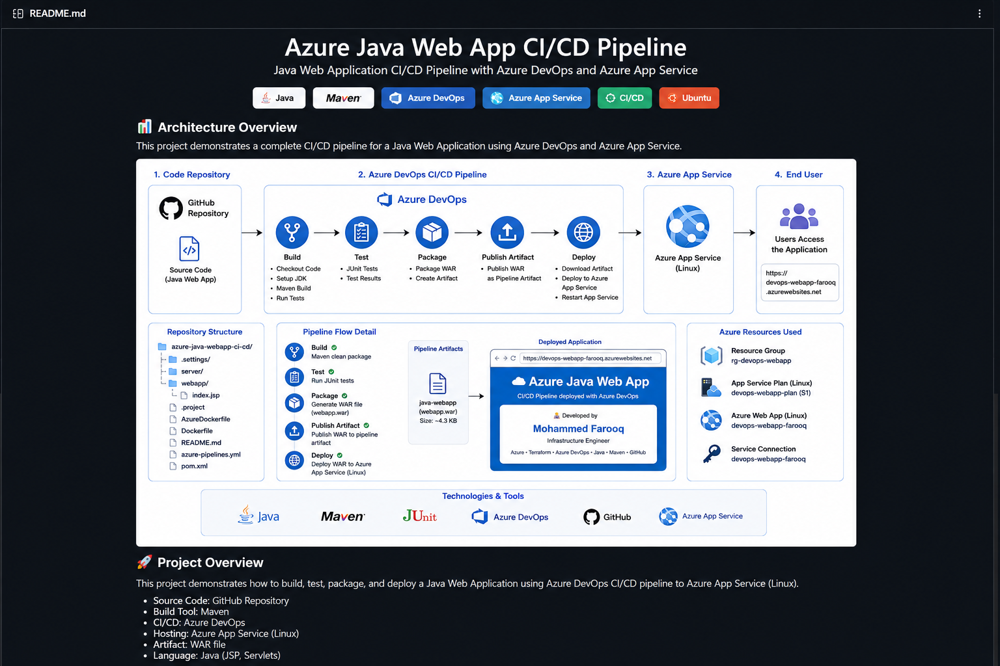

# ☁️ Azure Java Web App CI/CD Pipeline

> A production-ready Java Web Application automatically built, tested, packaged and deployed to **Microsoft Azure App Service** using **Azure DevOps CI/CD Pipelines**.


---

# 📖 Project Overview

This project demonstrates how to build a complete **Continuous Integration and Continuous Deployment (CI/CD)** pipeline using **Azure DevOps**.

Whenever new code is pushed to GitHub, Azure DevOps automatically:

- ✅ Checks out the source code
- ✅ Builds the Java application
- ✅ Executes JUnit tests
- ✅ Packages the application into a WAR file
- ✅ Publishes the WAR as a Pipeline Artifact
- ✅ Deploys the application to Azure App Service
- ✅ Makes the latest version available online

This repository focuses on **application deployment**, while the Azure infrastructure is provisioned separately using Terraform.

---

# 🏗️ Solution Architecture



---

# ⚙️ CI/CD Workflow

```text
Developer
      │
      ▼
GitHub Repository
      │
      ▼
Azure DevOps Pipeline
      │
      ├───────────── Build Stage ─────────────┐
      │                                       │
      ▼                                       ▼
Checkout Code                        Run Unit Tests
      │                                       │
      └──────────────┬────────────────────────┘
                     ▼
              Maven Package
                     │
                     ▼
          Publish Pipeline Artifact
                     │
                     ▼
              Deploy to Azure
                     │
                     ▼
           Azure App Service (Linux)
                     │
                     ▼
             Live Java Web Application
```

---

# 🚀 Azure DevOps Pipeline

The pipeline consists of two stages.

## Stage 1 – Build

- Checkout Source Code
- Restore Maven Dependencies
- Compile Java Application
- Execute Unit Tests
- Package WAR File
- Publish Pipeline Artifact

---

## Stage 2 – Deploy

- Download Pipeline Artifact
- Deploy WAR File
- Restart Azure Web App
- Verify Successful Deployment

---

# ☁️ Azure Resources

| Azure Resource | Purpose |
|----------------|---------|
| Resource Group | Logical container for Azure resources |
| App Service Plan | Linux hosting environment |
| Azure Web App | Hosts the Java application |
| Azure Resource Manager Service Connection | Secure Azure authentication |

---

# 💻 Technologies Used

| Technology | Purpose |
|------------|---------|
| Java 17 | Application Development |
| Maven | Build Automation |
| JUnit | Unit Testing |
| Azure DevOps | CI/CD Pipelines |
| Azure App Service | Application Hosting |
| GitHub | Source Control |
| Linux | Runtime Platform |

---

# 📂 Repository Structure

```text
azure-java-webapp-ci-cd
│
├── images/
│   ├── azure-java-webapp-ci-cd.png
│   ├── pipeline-success.png
│   ├── azure-webapp.png
│   └── running-application.png
│
├── server/
├── webapp/
│   └── src/main/webapp/index.jsp
│
├── Dockerfile
├── AzureDockerfile
├── pom.xml
├── azure-pipelines.yml
├── README.md
└── .gitignore
```

---

# 📸 Project Screenshots

## 🚀 Azure DevOps Pipeline

Successful multi-stage Azure DevOps pipeline demonstrating automated build and deployment.


---

## ☁️ Azure App Service

Azure Linux Web App successfully hosting the Java application.


---

## 🌍 Running Application

Live application deployed automatically using Azure DevOps.


---

# 🌍 Live Demo

The application is deployed to Azure App Service.

**Live Website**

👉 https://devops-webapp-farooq.azurewebsites.net

---

# ▶️ Run the Project Locally

Clone the repository

```bash
git clone https://github.com/blueberry247/azure-java-webapp-ci-cd.git
```

Navigate into the project

```bash
cd azure-java-webapp-ci-cd
```

Build the project

```bash
mvn clean package
```

Run locally

```bash
mvn tomcat7:run
```

---

# 🔄 Automated Deployment

Every push to the **master** branch automatically triggers:

```text
GitHub
   │
   ▼
Azure DevOps Pipeline
   │
   ▼
Build
   │
   ▼
JUnit Tests
   │
   ▼
Package WAR
   │
   ▼
Publish Artifact
   │
   ▼
Deploy to Azure App Service
   │
   ▼
Production Website
```

No manual deployment is required.

---

# 📌 Related Project

This application is deployed onto infrastructure provisioned using Terraform.

Repository:

**terraform-azure-webapp**

This project includes:

- Azure Resource Group
- Azure App Service Plan
- Azure Linux Web App
- Infrastructure as Code
- Azure DevOps Infrastructure Pipeline

Together these repositories demonstrate both Infrastructure as Code and Application CI/CD.

---

# 👨‍💻 Author

## Mohammed Farooq

Infrastructure Engineer

### Core Skills

- Azure
- Azure DevOps
- Terraform
- CI/CD
- Java
- Maven
- GitHub

GitHub Profile

https://github.com/blueberry247

---

# 🎯 Skills Demonstrated

- Azure DevOps
- Azure Pipelines
- Continuous Integration
- Continuous Deployment
- Java
- Maven
- JUnit
- Azure App Service
- GitHub
- Linux
- Pipeline Artifacts
- Infrastructure as Code
- DevOps Best Practices

---

# 🚀 Future Enhancements

- Docker Containerisation
- Azure Container Registry (ACR)
- Azure Kubernetes Service (AKS)
- Helm
- Azure Key Vault
- SonarQube
- Application Insights
- Deployment Slots
- Blue/Green Deployments
- OWASP Security Scanning

---

# ⭐ If you found this project useful, please consider starring the repository.