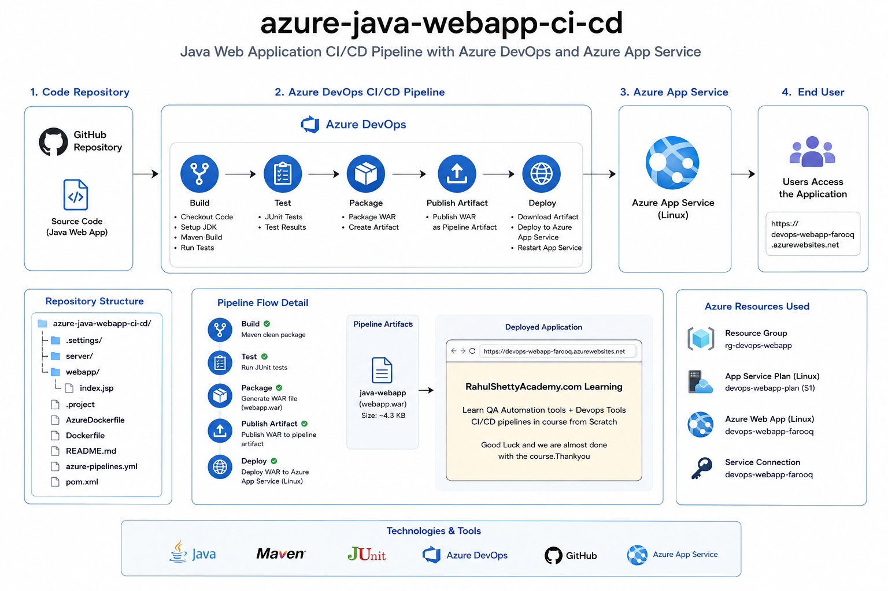
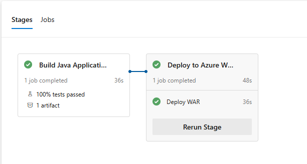
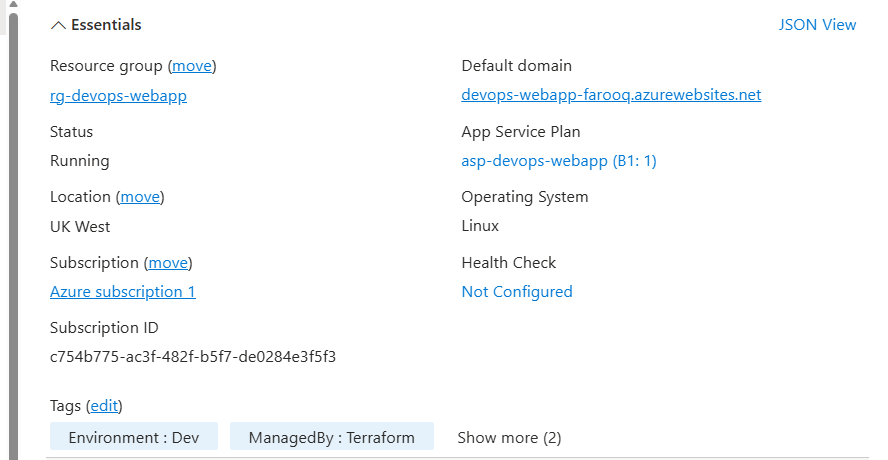
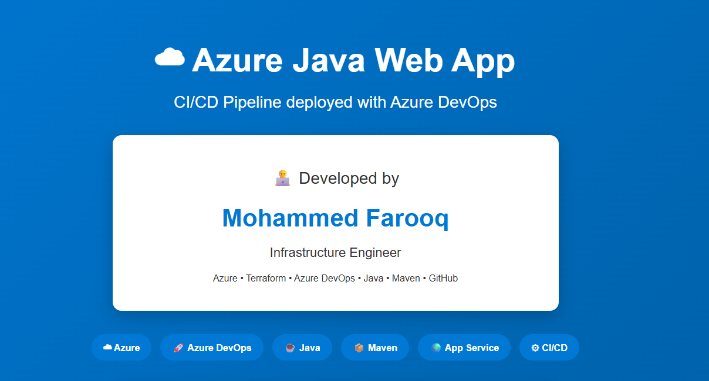

# ☁ Azure Java Web App CI/CD Pipeline

> A production-style Java Web Application automatically built, tested, packaged and deployed to **Azure App Service** using **Azure DevOps CI/CD Pipelines**.


---

# 🚀 Project Overview

This project demonstrates a complete **Continuous Integration and Continuous Deployment (CI/CD)** solution for a Java Web Application using **Azure DevOps** and **Azure App Service (Linux)**.

The solution automatically performs the following tasks every time code is pushed to GitHub:

- ✅ Checkout source code
- ✅ Build the application using Maven
- ✅ Execute JUnit unit tests
- ✅ Package the application into a WAR file
- ✅ Publish the WAR as a Pipeline Artifact
- ✅ Deploy the application to Azure App Service
- ✅ Make the application immediately available online

The project showcases a real-world Azure DevOps deployment pipeline and forms part of my Azure DevOps portfolio.

---

# 🏗 Architecture Overview



---

# ⚙ Solution Architecture

```
Developer
     │
     ▼
 GitHub Repository
     │
     ▼
 Azure DevOps Pipeline
     │
     ├───────────────┐
     ▼               │
 Build              Unit Tests
     │               │
     └──────┬────────┘
            ▼
      Package WAR
            │
            ▼
 Publish Pipeline Artifact
            │
            ▼
 Deploy to Azure App Service
            │
            ▼
 Azure Linux Web App
            │
            ▼
 Live Application
```

---

# 🚀 Azure DevOps Pipeline

The Azure DevOps pipeline consists of two fully automated stages.

## Stage 1 — Build

- Checkout Source Code
- Install Java 17
- Restore Maven Dependencies
- Compile Application
- Execute JUnit Tests
- Package WAR File
- Publish Pipeline Artifact

---

## Stage 2 — Deploy

- Download Pipeline Artifact
- Deploy WAR to Azure App Service (Linux)
- Restart Web Application
- Verify Successful Deployment

---

# ☁ Azure Resources

The solution deploys to the following Azure resources.

| Resource | Purpose |
|-----------|---------|
| Resource Group | Container for Azure resources |
| App Service Plan (Linux) | Hosting environment |
| Azure Linux Web App | Hosts the Java application |
| Azure Resource Manager Service Connection | Secure deployment authentication |

---

# 📂 Repository Structure

```text
azure-java-webapp-ci-cd
│
├── server/
├── webapp/
│   └── src/main/webapp/index.jsp
│
├── pom.xml
├── azure-pipelines.yml
├── Dockerfile
├── AzureDockerfile
├── README.md
├── azure-java-webapp-ci-cd.png
│
└── .gitignore
```

---

# 💻 Technologies Used

| Technology | Purpose |
|------------|---------|
| Java 17 | Application Development |
| Maven | Build Automation |
| JUnit | Unit Testing |
| Azure DevOps | CI/CD Pipeline |
| Azure App Service | Application Hosting |
| GitHub | Source Control |
| Linux App Service | Runtime Environment |

---

# 📸 Project Screenshots

## Azure DevOps Pipeline

*(Replace with your successful pipeline screenshot)*



---

## Azure Portal

*(Replace with your Azure App Service Overview screenshot)*



---

## Running Application

*(Replace with your deployed application screenshot)*



---

# 🌍 Live Demo

Azure Web Application

https://devops-webapp-farooq.azurewebsites.net

---

# ▶ Running Locally

Clone the repository

```bash
git clone https://github.com/blueberry247/azure-java-webapp-ci-cd.git
```

Move into the project

```bash
cd azure-java-webapp-ci-cd
```

Build the application

```bash
mvn clean package
```

Run locally

```bash
mvn tomcat7:run
```

---

# ☁ Automated Deployment

Every push to the **master** branch automatically triggers:

```
Git Push
      │
      ▼
Azure DevOps
      │
      ▼
Build
      │
      ▼
Unit Tests
      │
      ▼
Package WAR
      │
      ▼
Publish Artifact
      │
      ▼
Deploy to Azure App Service
      │
      ▼
Live Website
```

No manual deployment is required.

---

# 📌 Related Project

The Azure infrastructure used by this application is provisioned using Terraform.

Repository:

**terraform-azure-webapp**

Features include:

- Azure Resource Group
- Azure App Service Plan
- Azure Linux Web App
- Infrastructure as Code
- Azure DevOps Infrastructure Pipeline

Together these repositories demonstrate both:

- Infrastructure Deployment (Terraform)
- Application Deployment (Azure DevOps CI/CD)

---

# 👨‍💻 Author

## Mohammed Farooq

Infrastructure Engineer

Specialising in

- Azure
- Azure DevOps
- Terraform
- CI/CD
- Java
- GitHub

GitHub

https://github.com/blueberry247

---

# 🎯 Skills Demonstrated

- Azure DevOps Pipelines
- Continuous Integration
- Continuous Deployment
- Azure App Service
- Maven
- Java
- JUnit Testing
- Pipeline Artifacts
- GitHub Integration
- Linux App Service
- Infrastructure Deployment
- DevOps Best Practices

---

# 🚀 Future Enhancements

- Docker Containerisation
- Azure Container Registry (ACR)
- Azure Kubernetes Service (AKS)
- Helm Charts
- Azure Key Vault
- SonarQube Integration
- Application Insights
- Deployment Slots
- GitHub Actions
- OWASP Dependency Scanning

---

# 📜 License

This project is released under the MIT License.

---

⭐ If you found this project useful, please consider starring the repository.